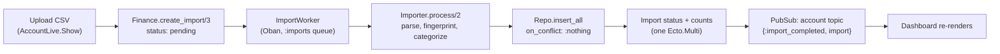

# Tally

A personal finance tracker. Upload a bank statement CSV, and Tally files
each transaction under a category (using rules you define), shows where
the money went this month, and shows the six-month spending trend. Built
for engineering hiring managers reviewing backend and data-correctness
skills.

[](https://github.com/Nabeel-Siddiqui/tally/actions)

**Runs locally in under 5 minutes** with seeded demo data. See
[Running it locally](#running-it-locally).

## What it does

- Track several accounts (checking, credit card), each with a running
  balance computed from its transactions.
- Import a bank statement CSV. Re-uploading an overlapping statement is
  safe: transactions already on the account are skipped, not duplicated.
- Bad rows don't sink the import. Each malformed row is reported with its
  line number, and the rest of the file still imports.
- Category rules: "any merchant containing `NETFLIX` is Subscriptions."
  Rules apply to every import from then on.
- A dashboard per account showing this month's spending by category and
  the trailing six months. It updates live when a background import
  finishes, with no page reload.

## Architecture decisions

Three of the less-obvious calls are written up in
[`docs/decisions/`](docs/decisions/), each with the alternative considered
and why it lost:

1. [Money is integer cents, never floats](docs/decisions/0001-money-as-integer-cents.md)
2. [Duplicate transactions are rejected by a database index, not by application code](docs/decisions/0002-fingerprint-dedupe.md)
3. [Imports run as background jobs, with the CSV carried in the job](docs/decisions/0003-imports-as-oban-jobs.md)

The import flow, end to end:



If a row fails to parse, the failure is recorded on the import
(`error_details`) and the other rows still go in. If the whole file is
unusable (for example, a missing `amount` column), the import is marked
failed with the reason, and the dashboard shows that reason.

## Tech stack

Phoenix 1.7 + LiveView · Ecto/Postgres · Oban (background imports) ·
NimbleCSV · Tailwind · Credo (`--strict`) + Dialyzer in CI · GitHub
Actions · Docker (`mix release`).

## Running it locally

Prerequisites: Elixir 1.20.3 / OTP 29.0.5 (see [`Dockerfile`](Dockerfile)
for the versions this was built against) and a local Postgres.

```bash
git clone https://github.com/Nabeel-Siddiqui/tally.git
cd tally
mix setup        # deps, DB create + migrate, seeds, assets
mix phx.server
```

Visit `http://localhost:4000` and log in as `demo@tally.dev` /
`demo-password-please-change`. The seeded account has six months of
transactions and a few category rules, so the dashboard is populated on
first load.

To check the whole thing end to end:

```bash
mix test                # 222 tests, no network calls
mix credo --strict
mix dialyzer
```

## CSV format

Imports expect a header row naming `date`, `description`, and `amount`
(any column order, extra columns ignored):

```csv
date,description,amount
2026-01-15,COFFEE SHOP 1234,-4.50
2026-01-16,ACME PAYROLL,2850.00
```

`date` is `YYYY-MM-DD`. `amount` has exactly two decimal places, negative
for spending.

## What I'd do next

- **Starting balances.** Balances are the sum of imported transactions, so
  they're only as complete as the history uploaded. An opening-balance
  field per account would fix that.
- **Smarter column detection.** Real bank exports vary a lot. Detecting
  common layouts (or letting the user map columns once per account) would
  remove the fixed-format requirement.
- **Rule precedence.** Rules currently match in alphabetical order by
  pattern, and the first match wins. Explicit priorities would make
  overlapping rules predictable.
- **Recategorizing history.** New rules only apply to future imports.
  Reapplying rules to existing transactions is a small job, and a
  natural next step.
